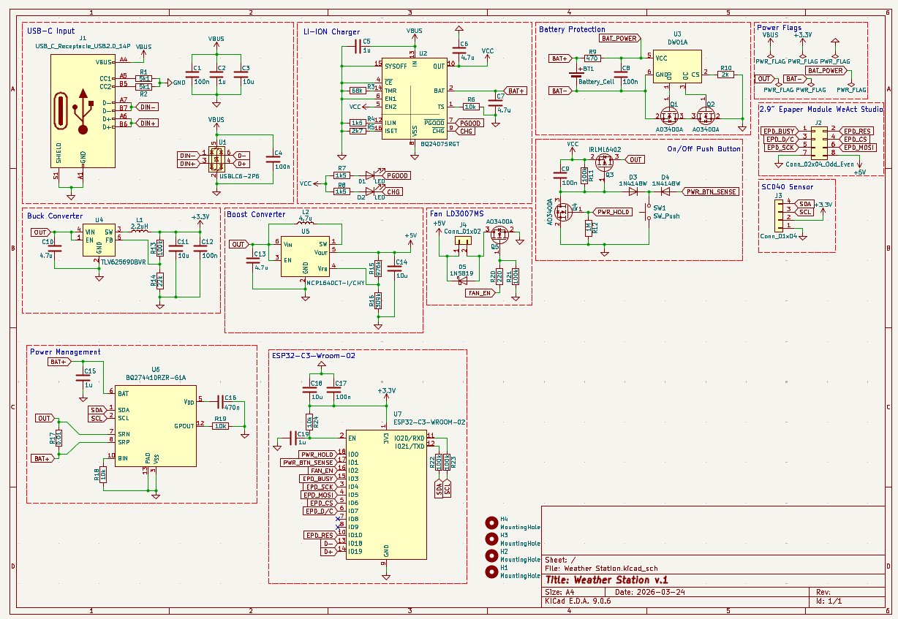
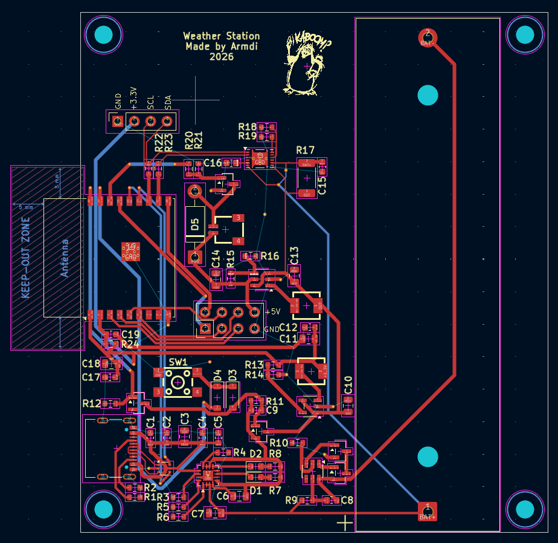
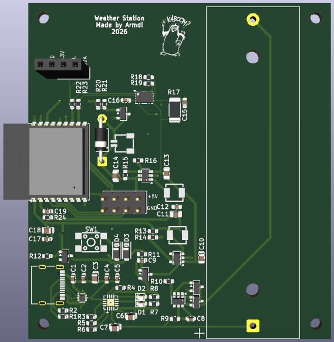

# weather-station
I always wondered if the amount of CO2 inside my room really affects my productivity. To find out, I started looking for sensors and found weather stations, which seemed not a good option, since they are expensive and ugly. Therefore, I decided to create my own device with needed features. In this case, SCD40 can be used as all-in-one sensor, with humidity, temperature and CO2 detection. For display, to make it consume as less energy as possible and produce little light, I chose e-ink from WeAct Studios. 

My initial idea was to create device, which works only with usb-c hub via esp32, but after long consideration, I chose to put 18650 battery with soft latching power button to turn the system on and off.

Weather station with humidity, temperature and CO2 sensor

